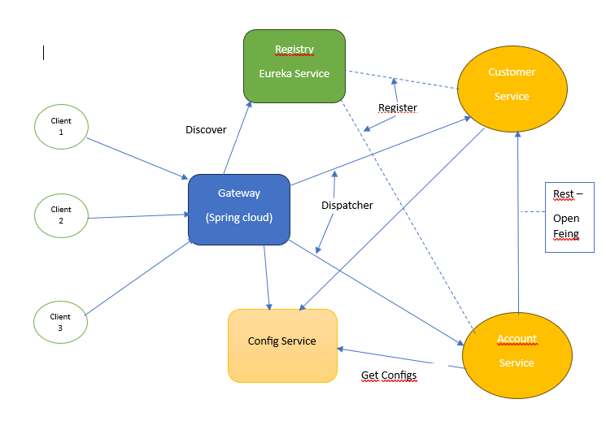

# bank-app-ws-cloud-eureka-docker-angular

## Les modules : 

- discovery-service : Eureka
- gateway : Spring-cloud & gateway
- customer-service & account-service : Spring Boot
- config-service : spring-cloud-config & actuator

## Les technologies utilisées : 

  - Spring Boot
  - JPA / Hibernate / Spring Data
  - H2 database
  - Lombok
  - Spring Doc (swagger)
  - Spring Cloud
  - Actuator : pour voir l'état du ws
  - Eureka : pour registrer les ws démarrer et pour faciliter le dispatching du gateway vers les ws
  - Spring cloud config server : pour centraliser les configs des ws dans un seul projet (config-service) et globaler les configs partagés entre plusieurs ws.
  - Resilience 4j : pour que si l'un des ws DOWN n'impact pas les autres ws et on lui fournir une réponse par défaut en cas de problème.
  - OpenFeign est une bibliothèque Java qui simplifie le développement de clients HTTP en utilisant une interface déclarative. Elle fait partie de la suite Spring Cloud et est souvent utilisée dans les applications basées sur microservices.

## Les commandes Docker utilisées : 

| Commande          | Description               |
| ----------------- | ------------------------- |
| docker compose down | Arreter tous les conteneurs démarrés |
| docker compose up -d --build | Démarrer tous les conteneurs  |
| docker ps     | Liste les conteneurs en cours d'exécution   |
| docker logs container_id / image_name     | Afficher les logs d'un conteneurs   |
| docker stop container_id     | Arrête un ou plusieurs conteneurs en cours d'exécution.   |
| docker start container_id | Démmare un ou plusieurs conteneurs en arret |
| docker restart container_id | Redémarre un conteneur|
| docker images | Liste les images disponibles sur la machine|
| docker run image_name | Crée et démarre un conteneur à partir d'une image|
| docker exec -it ID_conteneur commande | Exécute une commande à l'intérieur d'un conteneur en cours d'exécution|
| docker exec -it ID_conteneur commande | Exécute une commande à l'intérieur d'un conteneur en cours d'exécution|
| docker rm ID_conteneur | supprime un ou plusieurs conteneurs|
| docker rm image_id | supprime une ou plusieurs images|
| docker attach container_id | Attacher un terminal / console à un container pour executer des commande dans le container|
| docker inspect container_id | inspecter et afficher les informations d'un container|
